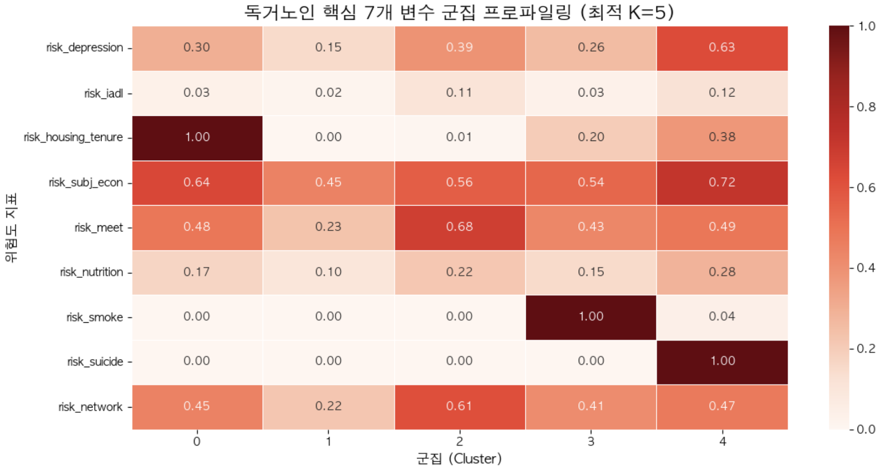
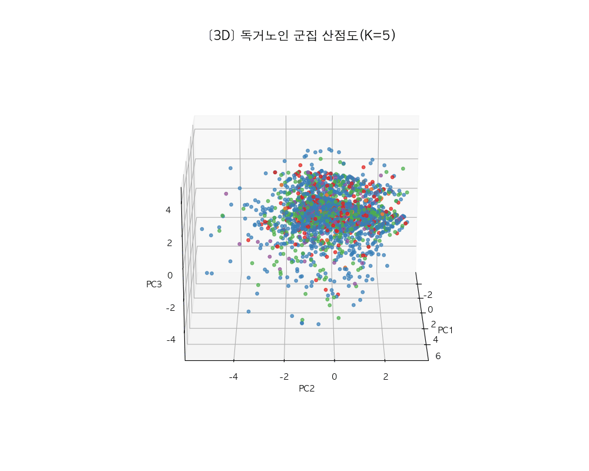
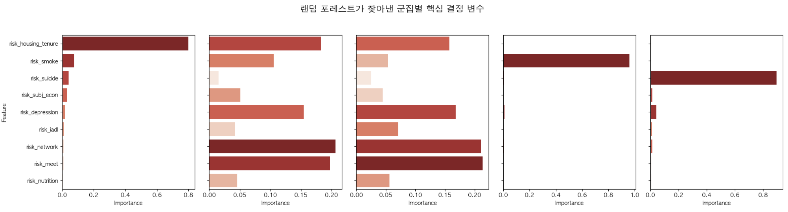

# [2026 SP] 데이터마이닝 : 독거노인 다차원 취약성 군집 분석 및 맞춤형 돌봄 정책 제안

### 팀
데이터마이닝 2조

### 팀원
산업공학과 산업정보시스템 전공
- 21101943 성주인
- 22101923 이석훈
- 24101968 조예린
- 24101970 차종진
---
### 1. 주제 배경 및 필요성
#### 고령화에 따른 독거노인가구 및 고독사 증가
- 근 2년간(2022~2024) 전국 독거노인가구 약 220만명 증가
- 고독사 사망자 중 60대 이상이 전체의 50.2%
- 한정된 지자체 예산과 인력으로 인한 기관별 1:1 모니터링 불가
- 클러스터링을 통한 '최저위험군'과 '초고위험군' 분류로 효율적인 예산 및 인력 분배 기대

#### 단순 기준 기반 대상자 선정의 한계
- 기관은 신체/정신/사회참여 영역의 취약요인을 조사하여 대상자 선정여부, 서비스 제공시간의 범위 등을 산정
- 현재의 '총점' 기반 대상자 선정은 특정 영역에서 심각한 어려움을 느끼는 대상자를 누락시켜버리는 제도적 한계 보유
- 특정 군집별 특징을 활용한 맞춤 서비스 제공을 통한 최적의 복지 서비스 제공 기대

---
### 2. 분석 목적
#### 유사 위험 패턴별 독거노인 집단 군집화를 통한 맞춤형 복지 개입 전략 도출
- 독거노인 다차원 취약성 지표(9개 위험도 변수)에 대한 탐색적 데이터 분석(EDA) 실시
- 스케일링(Min-Max, StandardScaler) 및 차원 축소(PCA)를 통한 최적의 전처리 파이프라인 구축
- K-Means 알고리즘을 활용한 독거노인 취약성 페르소나(5개 군집) 분류

#### 머신러닝 기반 '맞춤형 복지 정책 매칭' 아키텍처 제안
- 비지도학습(K-Means)으로 군집을 형성하고, 지도학습(Random Forest)으로 군집별 핵심 위험 변수(Feature Importance)를 교차 검증
- 기존 획일화된 돌봄 서비스의 한계를 극복하고, 한정된 복지 예산과 인력을 적재적소에 배치하기 위한 데이터 기반 차등적 자원 배분 전략 제시

---
### 3. 데이터 원본 및 전처리
#### 데이터 획득 및 규모
#### 1. 2023년 노인실태조사 마이크로데이터
- **데이터 출처:** 한국보건사회연구원
- **수록 항목:** 건강상태 및 행태, 기능상태(ADL/IADL), 가족/사회적 관계, 경제상태, 주거환경, 인지기능(CES-D 우울척도 15문항) 등 784개 변수
- **데이터 규모:** 최초 10,078명 중 독거노인 필터링 후 **3,448명 (Instances)**
- **데이터 활용 및 전처리 특징:**
  - **타겟 추출:** 노인가구형태 변수(HTYPE=1)를 기준으로 분석 대상 '독거노인' 추출(전체 노인의 34.2%)
  - **전처리 (결측/이상치 처리):** 무응답 및 비해당 코드(99 등)를 식별하여 분석 목적에 맞게 결측치로 전처리

#### 2. 독거노인 수 연령 및 시도별 현황
- **데이터 출처:** 보건복지부
- **수록 항목:** 전국 17개 시도 × 3개년(2022~2024) 데이터, 5개 연령대 인구 분포 (총 51개 행)
- **데이터 규모:** 전국 독거노인 총 **2,196,738명 (Instances)**
- **파생 변수 활용:** 시도별 독거노인 밀집도 변수를 구성 (결측치 0건 완결성 확인)

#### 3. 행정동별 성별 연령별 주민등록 인구수
- **데이터 출처:** 행정안전부
- **수록 항목:**  전국 3,618개 읍면동 행정구역 코드 및 단위별/성별 0세~110세 이상 연령별 인구수(총 230개 컬럼)
- **데이터 규모:** 전국 **3,618개 행정동 (Instances)**
- **데이터 활용 및 전처리 특징:**
  - **파생 변수 생성:** 65세 이상 인구를 합산하여 행정동별 '고령화율' 변수 산출, 행정구역 코드를 기준으로 마이크로데이터와 결합하여 분석에 활용
  - **전처리 (결측치 처리):** 세종특별자치시 산하 일부 행정동에서 발생한 시군구명 결측치 5건을 도메인 지식을 활용해 수동 보간

#### 4. 요양기관 개설 현황
- **데이터 출처:** 건강보험심사평가원
- **수록 항목:**  요양기관명, 요양종별(의원, 약국, 치과, 한의원, 병원, 보건소 등 15종), 시도명, 시군구명, 도로명주소
- **데이터 규모:** 전국 요양기관 **104,775개소 (Instances)** 
- **파생 변수 생성:** 시군구별 요양기관 수를 65세 이상 인구로 나누어 '인구당 의료 접근성'을 산출한 후, 이를 Min-Max (0~1)하여 의료 인프라 격차(infra_gap) 변수 생성

#### 주요 활용 지표 (Features)
초기 탐색 시 독거노인의 삶을 다각도로 측정할 수 있는 20개의 위험도 지표를 추출
- **신체/건강 지표:** 우울증(`risk_depression`), 일상생활 저하(`risk_iadl`), 영양 불량(`risk_nutrition`), 자살 위험(`risk_suicide`), 흡연(`risk_smoke`) 등
- **경제/주거 지표:** 주관적 경제난(`risk_subj_econ`), 주거 불안정(`risk_housing_tenure`) 등
- **사회/관계 지표:** 교류 단절(`risk_meet`), 지지망 부재(`risk_network`) 등

#### 데이터 전처리 (Data Preprocessing) & Feature Engineering
단순한 기준 기반 평가의 한계를 넘기 위해 머신러닝에 최적화된 데이터로 가공
- **다중공선성 및 노이즈 제거:** 군집화 성능을 저하시키는 방해 변수(예: 나이, 디지털 소외 등 전반적 공통 특성)와 의미가 중복되는 변수 11개를 후진제거법으로 제거 후, 핵심 9개 변수로 압축
- **스케일링 (StandardScaler):** 각 변수 간의 단위와 편차를 통일하여 K-Means의 거리 계산이 한쪽 변수에 편향되지 않도록 평균 0, 분산 1로 표준화를 적용

#### EDA 및 변수 선택(Feature Selection) 결과: 9개 핵심 지표 선정

- **건강 및 심리 지표 (Health & Mental Features)**
  - `risk_depression` : 우울증 위험도
  - `risk_iadl` : 일상생활수행능력(IADL) 저하
  - `risk_nutrition` : 영양 불량 위험
  - `risk_suicide` : 자살 위험도
  - `risk_smoke` : 흡연 고위험군
- **사회적 고립 지표 (Social Isolation Features)**
  - `risk_meet` : 대면 교류 단절 위험
  - `risk_network` : 인적 지지망 부재
- **경제 및 주거 지표 (Economic & Housing Features)**
  - `risk_subj_econ` : 주관적 경제난
  - `risk_housing_tenure` : 주거 불안정성 (월세, 임시거처 등)
 
### 4. 분석 결과

#### 모델링 및 타당성 검증 지표
단일 알고리즘의 한계를 극복하기 위해 비지도학습과 지도학습을 결합한 검증 파이프라인을 설계.

| 분석 단계 | 적용 알고리즘 | 최적 군집 수 (K) | 검증 방법 및 핵심 지표 |
| :--- | :--- | :---: | :--- |
| **군집화 (Clustering)** | K-Means | **5개** | 실루엣 스코어 : 0.2952  |
| **타당성 검증 (Validation)** | Random Forest Classifier | - | 군집별 핵심 결정 변수(Feature Importance) 도출 및 K-Means 결과와 교차 검증 |

#### [K=5] 독거노인 군집별 프로파일링 주요 결과
알고리즘 분석 결과, 전체 3,448명의 독거노인은 뚜렷한 특징을 가진 5개의 페르소나로 분류되었습니다.

#### 클러스터 해석
#### ***[k-means 군집화 결과 | 히트맵 ]***

#### ***[k-means 군집화 결과 | 2차원 산점도 ]***
.png>)
#### ***[k-means 군집화 결과 | 3차원 산점도 ]***


#### ***[Random forest 결과 | 군집별 주요 중요 변수 ]***

#### ***[군집별 instance 수 (전체의 %) ]***


- **Cluster 0 (주거취약형, 396명 / 11.5%)**
  - **특징:** 타 지표 대비 주거 불안정성(월세, 임시거처 등)이 압도적으로 높은 물리적 취약 그룹. (공공임대 및 주거환경 개선 대상)
- **Cluster 1 (최저위험/자립형, 1,921명 / 55.7%)**
  - **특징:** 경제적 어려움은 일부 존재하나, 인적 네트워크가 탄탄하여 우울증 위험이 가장 낮고 자립적인 생활을 영위하는 다수 그룹. (보편적 커뮤니티 복지 대상)
- **Cluster 2 (사회적 고립형, 847명 / 24.6%)**
  - **특징:** 경제나 주거는 평균 수준이나, 대면 교류 및 지지망이 완전히 단절되어 정서적 취약성이 극대화된 그룹. (사회적 관계망 복원 우선 대상)
- **Cluster 3 (생활습관/흡연위험형, 212명 / 6.1%)**
  - **특징:** 타 지표는 평균에 수렴하나, 흡연 위험도가 극단적으로 높아 장기적 건강 악화가 우려되는 특수 그룹. (보건소 연계 건강 관리 대상)
- **Cluster 4 (초고위험/생명위기형, 72명 / 2.1%)**
  - **특징:** 자살 위험(89%), 우울증, 경제난 등 모든 취약성 지표가 최고조에 달한 사각지대 극소수 그룹. (행정력 집중 및 1:1 밀착 전담 마크 대상)

---
### 5. 기대 효과
보건복지부에서는 독거노인 복지서비스 **노인맞춤돌봄서비스**를 제공함.
이 서비스는 안전 확인, 사회참여지원, 생활교육지원, 일상생활지원 등 세분화된 서비스가 제공되고 있지만, 현장에서 이 서비스를 제공해주는 전담사회복지사, 생활지원사의 수는 독거노인 수에 비해 부족한 상황.

이러한 **인력부족** 속에서 ‘누구에게, 어떤 강도로, 어떤 서비스를 매칭해주는지’에 대한 정밀한 기준이 부족하기에 정부도 **대상자 선정도구**[^1] 를 활용하여 총점을 계산하고 우선순위를 지정하고 있음. 하지만, 이는 특정 영역에서 심각한 어려움을 느끼는 대상자를 누락시켜버리는 한계점을 보임.

또한, 운둔형/우울형 노인에 대한 **특화 서비스 별도 실시**서비스도 제공되고 있지만, 은둔형과 우울형 노인 발굴에도 많은 시간과 노력이 소요되는 상황임

[^1]: **대상자 선정도구** : 현재 보건복지부 노인맞춤돌봄서비스에서 대상자를 선정할 때 사용하는 신체/정신/사회참여 영역의 종합 평가 지표.

**클러스터링을 통한 인적 자원 분배**
클러스터링 결과 최저위험군이 전체의 약 55%를 차지하고, 최고위험군은 전체의 2.1%를 차지하고 있다. 클러스터링을 활용하면 부족한 인적자원을 효율적으로 활용할 수 있음
- [Cluster 1 : 최저위험군/자립형] 온라인을 통한 개인 연락 안부 서비스 위주로 독거노인가구 관리
- [Cluster 4 : 초고위험군] 전담사회복지사 일대일 매칭과 방문 서비스, 정신건강 상담 및 응급 연계 중심 관리 등 다양한 복지 서비스를 제공하여 집중 관리

**군집별 특징을 활용한 맞춤 서비스 제공**
- [Cluster 0 : 주거취약형] 주거환경 개선 안전설비 지원 및 주거지원연계 서비스 최우선 제공
- [Cluster 2 : 사회적 고립형] 정기 방문 및 안부 확인 서비스와 사회참여활동 및 모임 활성화 지원 서비스 제공
- [Cluster 3 : 생활습관/흡연위험형] 금연 및 건강 검진 등 보건/건강교육 및 치료 프로그램 제공


 **랜덤포레스트 중요도를 통한 명확한 대상자 색출**
- [Cluster 2]의 경우, `risk_meet` & `risk_network` & `risk_depression`이 주요 변수로 확인되므로 은둔형 노인으로 판단
- [Cluster 4]의 경우, `risk_suicide`가 주요 변수로 우울형 노인으로 판단
  위와 같은 군집 라벨링을 통해 즉시 특화지원 서비스의 명확한 대상자를 별도의 기간 및 추가 판단 기준 없이 색출 가능


---
### 6. 한계점 및 향후 연구 과제

#### 연구의 한계점
- **횡단면(Cross-sectional) 데이터의 한계:** 본 분석은 특정 시점(2023년)의 설문 데이터를 바탕으로 수행되어, 노인들의 위험도가 시간 흐름에 따라 어떻게 변화하는지(인과관계 및 취약성 전이 과정)를 추적하기 어려움
- **데이터 간의 시점 불일치(Temporal Misalignment):** 핵심 자료로 활용한 노인실태조사는 2023년 기준이나, 외부 결합 데이터(인구 현황, 요양기관 등)는 2024~2026년 최신 기준을 활용함. 인구 구조나 인프라 등은 단기간에 급변하지 않는 거시 지표이나, 엄밀한 통계적 시점 불일치가 존재한다는 한계가 있음. 단, 이는 모델의 '현재적 정책 적용성'을 극대화하기 위한 데이터 가용성 측면의 불가피한 선택이었습니다.
- **자기기입식 응답의 편향:** '주관적 경제난'이나 '우울감' 등 주요 지표가 응답자의 주관적 판단에 의존하므로, 실제 객관적 지표(소득 분위, 병원 진료 기록 등)와의 오차가 존재할 수 있음
- **분석 방법론적 한계:** K-Means 알고리즘 특성상 데이터의 비선형적인 관계나 복잡한 밀도 차이를 완벽하게 반영하는 데는 한계가 존재

#### 개선방안 및 추후 연구 진행 방안
- **시계열 데이터 분석 도입:** 다년간의 추적 조사를 결합하여, "어떤 요인이 Cluster 1(최저위험/자립형), Cluster 2(사회적 고립형) 또는 Cluster4(초고위험군)으로 전락하게 만드는가?"에 대한 동태적 변화 과정을 모델링
- **공공 행정 데이터 결합:** 설문 데이터뿐만 아니라 지자체의 실제 '복지 서비스 이용 이력', '건강보험 요양급여 내역', '거주지 주변 인프라(공간 데이터)' 등 객관적 데이터를 결합하여 프로파일링의 정밀도를 극대화
- **맞춤형 복지 자동 매칭 시스템 고도화:** 랜덤 포레스트로 도출한 핵심 변수를 활용하여, 읍면동 주민센터 방문 시 몇 가지 핵심 질문만으로 해당 노인의 소속 군집을 즉시 판별하고 최적의 돌봄 서비스를 자동 추천하는 시스템으로 발전


출처

- 한국보건사회연구원(2024), [2023년 노인실태조사 마이크로데이터 및 조사지침서], 보건복지데이터포털.
- 보건복지부(2024), [시도별 연령별 독거노인 현황통계(2022~2024)], 공공데이터포털.
- 행정안전부(2024), [주민등록인구통계: 지역별(행정동) 성별·연령별 인구수(2026년 4월 기준)], 공공데이터포털.
- Shahria, M. A., Mithila, S. D., Alam, T., Mahmood, M. S., & Khatun, M. (2026). Uncovering latent patterns in social media usage and mental health: A clustering-based approach using unsupervised machine learning. arXiv preprint.
- [2025, Development of machine learning models with explainable AI for frailty risk prediction and their web-based application in community public health, Frontiers in Public Health]

---

## 공지사항

### 🚨 필수 확인: 원본 데이터 다운로드 안내
본 프로젝트에 사용된 **'2023년 노인실태조사 마이크로데이터'** 등 원본 데이터 파일은 국가 기관(한국보건사회연구원 등)의 데이터 라이선스 및 보안 규정에 따라 GitHub에 직접 공개하지 않습니다. 파이프라인 코드를 직접 실행해 보시려면 아래 절차에 따라 원본 데이터를 먼저 세팅해 주시기 바랍니다.

- **[원본 데이터 다운로드 (Google Drive)](https://drive.google.com/drive/folders/10hHiaxvby0wxV9jHpkyCVPQH4yonwNuo?usp=sharing)**
  *(위 링크를 클릭하여 접근 권한을 요청해 주시면, 확인 후 승인해 드립니다.)*
- **세팅 방법**: 다운로드한 원본 `.csv` 파일들을 프로젝트 최상단 경로에 있는 `DataSet/` 디렉토리 내부에 위치시켜 주세요.
- **주의 사항**: 용량 및 보안 문제 방지를 위해 `DataSet/` 디렉토리는 반드시 `.gitignore`에 지정하여 GitHub에 원본 데이터가 업로드(Push)되지 않도록 주의 바랍니다.

---

### 🛠 개발 환경
> **Environment**: Jupyter Notebook 

### 📬 연락처 및 문의
본 독거노인 위험도 군집 분석 모델링 및 데이터 파이프라인과 관련하여 문의 사항이 있으신 경우 아래 이메일로 연락 바랍니다.
- **이메일**: sukhoon0405@seoultech.ac.kr

## 빠른 시작
### 환경 요구사항
```bash
# Python 버전
Python 3.11.9 - 3.13 (개발 환경: 3.11.9)

# 필수 시스템 사양
- RAM: 24GB 이상 권장 (개발 환경)
- 저장공간: 5GB 이상
```
### 즉시 실행 (분석만 진행하는 경우) / bash 실행
```bash
1. 저장소 클론
git clone [https://github.com/sukhoon-Lee/Elderly-Care-Clustering.git](https://github.com/sukhoon-Lee/Elderly-Care-Clustering.git)
cd Elderly-Care-Clustering

2. 가상환경 생성 및 활성화
python -m venv venv
source venv/bin/activate  # Windows: venv\Scripts\activate

3. 필수 패키지 설치
pip install -r requirements.txt

4.  데이터 다운로드 (Google Drive) - 위 공지사항 참고
# data.zip을 프로젝트 루트에 압축 해제

5. 데이터 전처리 및 분석 실행 (.ipynb 주피터 노트북 파일을 이용하는 것을 권장)
# 데이터 전처리 및 스케일링
jupyter nbconvert --to notebook --execute --inplace preprocessor.ipynb
# 2) 후진제거법을 통한 핵심 변수 추출
jupyter nbconvert --to notebook --execute --inplace Backward_Elimination.ipynb
# 3) 최종 모델 학습 및 프로파일링
jupyter nbconvert --to notebook --execute --inplace Modeling.ipynb
```

### 프로젝트 구조
## 프로젝트 구조

```text
Elderly-Care-Clustering/
├── README.md                              # 프로젝트 가이드
├── requirements.txt                       # 패키지 의존성
├── .gitignore                             # Git 무시 파일
│
├── DataSet/                               # 데이터 디렉토리 (Git 제외, 외부 링크 다운로드)
│   ├── single variable_data.csv           # 전처리 및 스케일링이 완료된 통합 데이터
│   └── (2023 노인실태조사_DATA.csv 외 2개 원본 csv파일)
│
├── 시각화 결과물 (Images/GIFs)
│   ├── cluster_3d_animation.gif           # 군집화 결과 3D 애니메이션
│   ├── Cluster_heatmap.png                # 군집별 핵심 위험도 프로파일링 히트맵
│   ├── Find_the_optimized_k_value.png     # 최적의 K값 탐색 (Elbow/Silhouette)
│   ├── RandomForest_Result.png            # 랜덤 포레스트 기반 변수 중요도 결과
│   ├── Visualize_Clustering_(2D).png      # 2D PCA 군집화 시각화
│   └── Total_instance.png                 # 군집별 인원수 및 비율 요약
│
├── 분석 파이프라인 (Jupyter Notebooks)
│   ├── preprocessor.ipynb                 # [STEP 1] 데이터 정제 및 스케일링
│   ├── Backward_Elimination.ipynb         # [STEP 2] 후진제거법 기반 핵심 변수 추출
│   └── Modeling.ipynb           # [STEP 3] K-Means 군집화 및 RF 프로파일링
│               
└── 타당성 검증 모델 (비교 분석용)
    ├── DBSCAN.ipynb                       # 밀도 기반 군집화 비교 실험 (군집 붕괴 확인)
    └── Agglomorative.ipynb                # 계층적 군집화 비교 실험 (구조적 안정성 검증)
```

## 재현 가이드

### 단계별 실행

#### 1단계: 환경 설정
```bash
# Python 버전 확인 (3.11.9 권장 / 3.13 런타임 환경 테스트 완료)
python --version

# 가상환경 생성 및 활성화 (충돌 방지를 위해 가상환경 사용을 권장합니다)

python -m venv venv
source venv/bin/activate  # Windows: venv\Scripts\activate

# 패키지 설치
pip install -r requirements.txt
```

#### 2단계: 데이터 전처리
```bash
# Jupyter 노트북으로 실행 (권장)
jupyter notebook preprocessor.ipynb

# 또는 Python 스크립트로 실행
python preprocessor.py
```
#### 3단계 : 핵심 변수 추출
```bash
# Jupyter 노트북으로 실행 (권장)
jupyter notebook Backward_Elimination.ipynb

# 또는 Python 스크립트로 실행
python Backward_Elimination.py
```

#### 4단계: 클러스터링 분석(최종 모델링 및 프로파일링 시각화)
```bash
# Jupyter 노트북으로 실행 (권장)
# K-Means 군집화 및 RF 프로파일링 
jupyter notebook Modeling.ipynb

# 또는 Python 스크립트로 실행
python Modeling.py
```


### 결과 파일
```
실행 완료 후 확인 가능한 주요 결과물:
├── DataSet/
│   └── single variable_data.csv           # 스케일링이 완료된 통합 분석용 데이터
│
├── 프로젝트 루트 (또는 이미지 출력물)
│   ├── Total_instance.png                 # 군집별 인원수 및 비율 요약표
│   ├── Cluster_heatmap.png                # 군집별 핵심 위험도 프로파일링 히트맵
│   ├── RandomForest_Result.png            # 랜덤 포레스트 변수 중요도 (원인 분석)
│   ├── Visualize_Clustering_(2D).png      # 2D PCA 기반 군집 시각화
│   └── cluster_3d_animation.gif           # 3D 군집 분포 애니메이션
```

---
## 문제 해결 가이드

### 자주 발생하는 오류
#### 1. KeyError:'cluster' 오류
주피터 노트북에서 K-Means 군집화 모델을 돌리기 전에 랜덤 포레스트나 요약표 출력 셀 먼저 실행 시, 데이터프레임에 cluster열이 생성되지 않았을 때 발생. (메모리 덮어쓰기 꼬임)
주피터 상단의 [Kernel] ➔ [Restart Kernel and Run All Cells...]를 클릭하여, 위에서 아래로 순서대로 실행

#### 2. 한글 폰트 오류
```python
import matplotlib.pyplot as plt
import platform

if platform.system() == 'Windows':
    plt.rc('font', family='Malgun Gothic')
elif platform.system() == 'Darwin': # macOS

    plt.rc('font', family='AppleGothic')
plt.rcParams['axes.unicode_minus'] = False
```

#### 3. Github Push 시 'File too large'오류 발생
100MB 이상의 대용량 원본 데이터 파일이 포함된 DataSet/ 폴더를 GitHub에 업로드하여 발생

---
